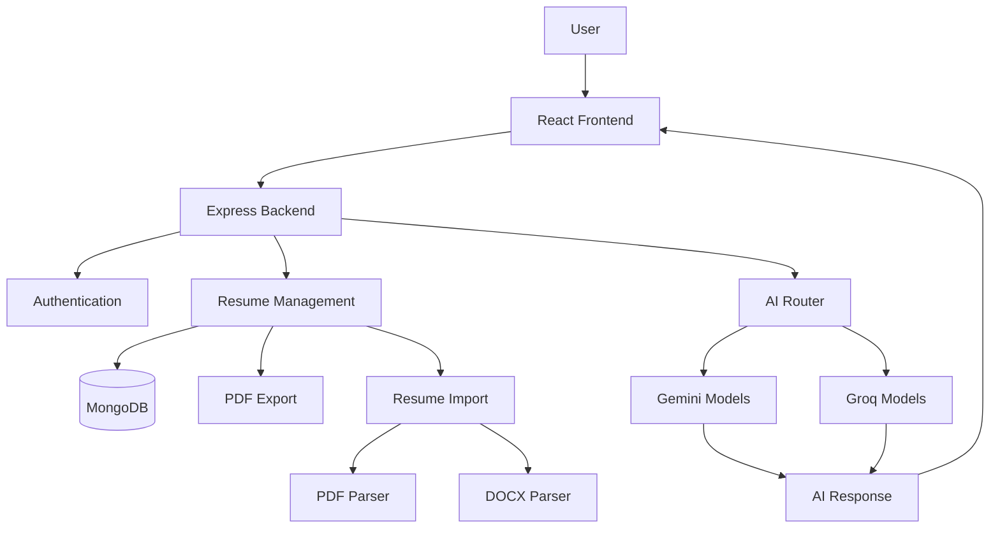
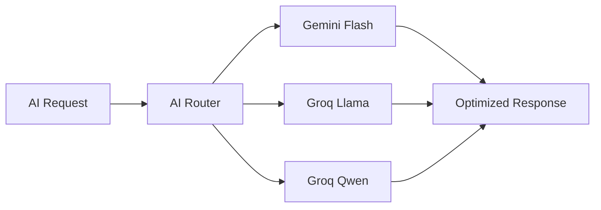
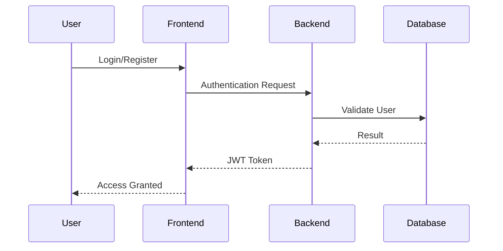

# 🚀 ResumeRocket - AI-Powered Resume Optimization Platform

<div align="center">

### Build ATS-Optimized Resumes with AI

Create, optimize, analyze, and tailor professional resumes using AI-powered assistance.


[Live Demo](#) • [Architecture](docs/architecture.md) • [System Design](docs/system_design.md) • [Interview Guide](docs/interview_guide.md)

</div>

---

# 📌 Overview

ResumeRocket is a full-stack AI-powered Resume Optimization Platform designed to help students, job seekers, and professionals create highly optimized resumes for modern hiring systems.

Unlike traditional resume builders, ResumeRocket combines AI-assisted content generation, ATS optimization, resume parsing, job description matching, and intelligent resume reviews into a single platform.

Users can generate resumes from scratch, import existing resumes, optimize them for specific job descriptions, and continuously improve their ATS readiness using actionable AI feedback.

---

# ✨ Features

## 🎯 Resume Builder

* Dynamic Resume Creation
* Real-Time Resume Preview
* Professional Resume Templates
* Theme Customization
* PDF Export
* Mobile Responsive Interface

---

## 🤖 AI Resume Assistant

Generate and improve:

* Professional Summaries
* Experience Descriptions
* Project Descriptions
* Technical Skills
* Resume Content Refinement

Powered by:

* Google Gemini
* Groq LLMs

Includes intelligent model routing for improved performance and reliability.

---

## 📊 ATS Resume Analysis

Analyze resumes against ATS standards.

Provides:

* ATS Score
* Missing Keywords
* Formatting Suggestions
* Content Quality Review
* Resume Completeness Analysis

---

## 🎯 Job Description Matching

Paste any job description and instantly receive:

* Match Score
* Matching Skills
* Missing Keywords
* Optimization Suggestions
* ATS Improvement Recommendations

---

## 📂 Resume Import & Parsing

Import resumes from:

* PDF
* DOCX

Automatically extracts:

* Personal Information
* Education
* Experience
* Projects
* Skills
* GitHub Links
* LinkedIn Profiles
* Portfolio URLs

and converts them into editable resume data.

---

## 🔄 Resume Versioning

Track changes and resume evolution.

Features:

* Snapshot Creation
* Version History
* Restore Previous Versions
* Resume Progress Tracking

---

## 📈 Placement Analytics Dashboard

Track:

* Resume Score History
* ATS Readiness
* Template Usage
* Resume Improvement Trends
* Optimization Progress

---

# 🏗️ System Architecture



---

# 🧠 AI Architecture

ResumeRocket uses a provider-agnostic AI routing layer.



### Benefits

* Faster Response Times
* Free-Tier Optimization
* Automatic Failover
* Better Reliability
* Reduced Downtime

---

# 🛠️ Tech Stack

## Frontend

* React 19
* Vite
* Tailwind CSS
* React Router
* Axios
* Framer Motion

## Backend

* Node.js
* Express.js
* MongoDB
* Mongoose
* JWT Authentication
* Multer

## AI Layer

* Google Gemini
* Groq
* AI Routing Engine

## Resume Processing

* PDF Parsing
* DOCX Parsing
* Resume Analysis Engine

---

# 📂 Project Structure

```text
ResumeRocket
│
├── frontend
│   ├── src
│   │   ├── components
│   │   ├── pages
│   │   ├── context
│   │   ├── services
│   │   └── templates
│   │
│   └── public
│
├── backend
│   ├── controllers
│   ├── routes
│   ├── services
│   ├── middleware
│   ├── models
│   └── config
│
├── docs
│
└── README.md
```

---

# 🔐 Authentication Flow



---

# 🚀 Getting Started

## Clone Repository

```bash
git clone https://github.com/Sanat1427/ResumeBuilder.git

cd ResumeBuilder
```

---

## Backend Setup

```bash
cd backend

npm install

npm run dev
```

Create a `.env` file:

```env
PORT=4000

MONGO_URI=YOUR_MONGODB_URI

JWT_SECRET=YOUR_SECRET

GEMINI_API_KEY=YOUR_GEMINI_KEY

GROQ_API_KEY=YOUR_GROQ_KEY
```

---

## Frontend Setup

```bash
cd frontend

npm install

npm run dev
```

Create `.env`:

```env
VITE_API_URL=http://localhost:4000
```

---

# 📦 Core Modules

## Authentication

* User Registration
* Login
* JWT Authorization

## Resume Management

* Create Resume
* Update Resume
* Delete Resume
* Export Resume

## AI Services

* Summary Generation
* Experience Generation
* Project Generation
* Resume Review
* ATS Analysis
* JD Matching

## Resume Import

* PDF Resume Parsing
* DOCX Resume Parsing

---

# 🎨 Resume Templates

Supported Templates:

* Modern Professional
* ATS Friendly
* Minimal Design
* Placement Focused Layouts

Each template supports:

* PDF Export
* Theme Switching
* Live Preview
* Real-Time Updates

---

# 📈 Future Roadmap

* AI Cover Letter Generator
* Interview Preparation Assistant
* Mock Interview Simulator
* LinkedIn Profile Optimizer
* Portfolio Generator
* Recruiter Dashboard
* Resume Benchmarking

---

# 🏆 Learning Outcomes

This project demonstrates:

* Full Stack Development
* System Design
* AI Integration
* Authentication & Security
* Database Design
* Resume Parsing
* ATS Optimization
* Production Deployment
* Scalable Backend Architecture

---

# 👨‍💻 Author

### Sanat Kishore

B.Tech Computer Science & Engineering (AI/ML)

BIT Mesra

GitHub: https://github.com/Sanat1427

LinkedIn: Add Your LinkedIn URL

---

## ⭐ Support

If you found this project useful, consider giving it a star on GitHub.

It helps others discover the project and motivates further development.
