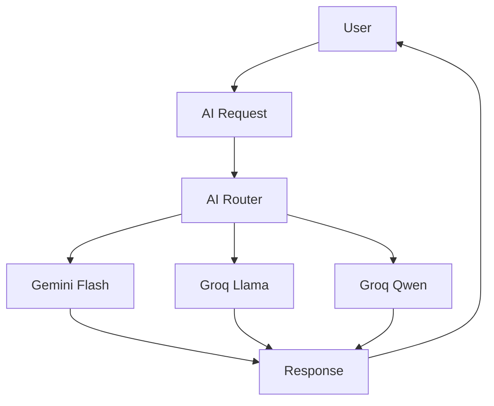
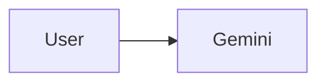
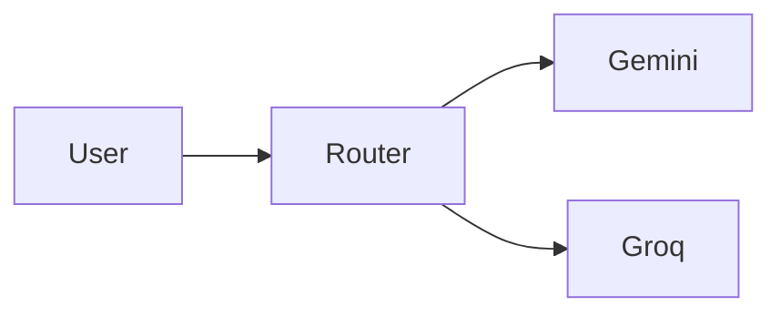
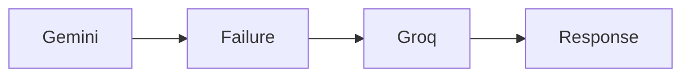
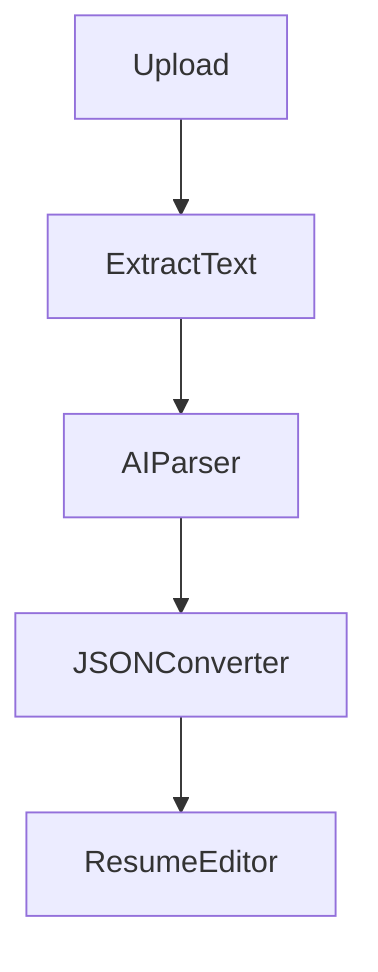
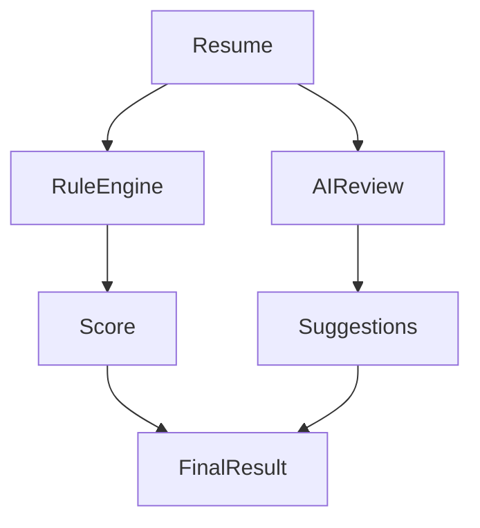
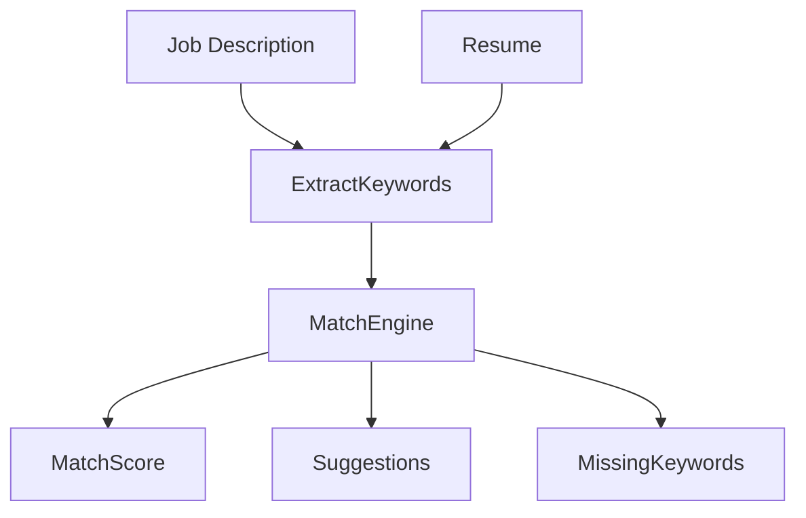

# 🧠 ResumeRocket AI Pipeline

This document explains the complete AI architecture of ResumeRocket, including provider routing, resume parsing, ATS analysis, job description matching, prompt engineering, fallback mechanisms, and future AI scalability plans.

---

# 📌 Overview

ResumeRocket is built around an AI-first architecture.

AI is responsible for:

* Resume Summary Generation
* Experience Generation
* Project Description Generation
* ATS Analysis
* Resume Review
* Job Description Matching
* Resume Parsing
* Keyword Extraction
* Skill Recommendations

Instead of relying on a single model provider, ResumeRocket uses a provider-agnostic AI routing layer that intelligently selects the most suitable model.

---

# 🎯 AI Design Goals

The AI system was designed to achieve:

### Functional Goals

* Generate professional resume content
* Analyze ATS readiness
* Tailor resumes for jobs
* Parse uploaded resumes
* Improve existing content

### Non-Functional Goals

* Low latency
* High availability
* Fault tolerance
* Cost efficiency
* Provider independence

---

# 🏗️ AI Architecture



---

# 🤖 AI Router

The AI Router acts as the central decision-making layer.

Its responsibilities:

* Provider Selection
* Failover Handling
* Retry Management
* Latency Optimization
* Request Logging

---

## Why Build an AI Router?

Without routing:



Problems:

* Single Point of Failure
* Rate Limits
* Downtime
* Vendor Lock-In

---

With routing:



Benefits:

* Better Reliability
* Automatic Failover
* Faster Responses
* Lower Operational Risk

---

# 🔀 Routing Strategy

ResumeRocket routes requests based on task type.

---

## Content Generation Tasks

Examples:

* Resume Summary
* Experience Generation
* Project Generation

Priority:

```text
Gemini Flash
↓
Groq Llama
↓
Groq Qwen
```

Reason:

Gemini generally provides stronger long-form writing quality.

---

## ATS Analysis Tasks

Examples:

* Resume Review
* ATS Analysis
* Keyword Analysis

Priority:

```text
Groq Llama
↓
Groq Qwen
↓
Gemini Flash
```

Reason:

Lower latency and structured outputs.

---

## Resume Parsing Tasks

Examples:

* PDF Resume Import
* DOCX Resume Import

Priority:

```text
Gemini Flash
↓
Groq Llama
```

Reason:

Better document understanding and information extraction.

---

# 🔄 Failover Mechanism

If the primary provider fails:



---

## Failure Conditions

Fallback is triggered when:

* Timeout
* Rate Limit
* Invalid Response
* API Failure
* Network Error

---

# ⏱️ Retry Strategy

Each request can be retried.

Example:

```text
Attempt 1 → Gemini

Failed

Attempt 2 → Gemini

Failed

Attempt 3 → Groq

Success
```

Benefits:

* Improved Reliability
* Better User Experience

---

# 📄 Resume Parsing Pipeline

ResumeRocket supports importing existing resumes.

---

## Supported Formats

```text
PDF
DOCX
```

---

## Pipeline



---

# Step 1: Text Extraction

### PDF

Uses:

```text
pdf-parse
```

---

### DOCX

Uses:

```text
mammoth
```

---

# Step 2: AI Understanding

Raw resume text is sent to AI.

Example:

```text
John Doe

Software Engineer

Experience:
Amazon SDE Intern
...
```

AI identifies:

* Name
* Email
* Education
* Experience
* Projects
* Skills
* Certifications
* GitHub Links
* LinkedIn Links

---

# Step 3: Structured Output

AI returns:

```json
{
  "personalInfo": {},
  "education": [],
  "experience": [],
  "projects": [],
  "skills": []
}
```

This format is directly injected into the Resume Editor.

---

# 🎯 ATS Analysis Pipeline

ATS analysis uses a hybrid architecture.

---

## Why Hybrid?

Pure rule-based systems:

✅ Fast

❌ Limited understanding

---

Pure AI systems:

✅ Smart

❌ Expensive

❌ Less predictable

---

Solution:

Hybrid Approach.

---

## ATS Flow



---

# ATS Scoring Dimensions

---

## 1. Completeness

Checks:

* Contact Information
* Education
* Experience
* Projects
* Skills

---

## 2. Keyword Coverage

Checks:

* Technical Skills
* Industry Keywords
* Missing Keywords

---

## 3. Formatting

Checks:

* Section Structure
* Readability
* ATS Compatibility

---

## 4. Content Quality

Checks:

* Action Verbs
* Quantified Impact
* Clarity

---

# ATS Formula

```text
ATS Score

=
30% Completeness

+
30% Keywords

+
20% Formatting

+
20% Content
```

---

# 🎯 Job Description Matching

One of ResumeRocket's most valuable features.

---

## User Input

```text
Paste Job Description
```

---

## Processing Pipeline



---

# Keyword Extraction

Extracts:

* Technologies
* Frameworks
* Skills
* Responsibilities
* Qualifications

Example:

```text
React
Node.js
MongoDB
AWS
Docker
```

---

# Match Score

Formula:

```text
Matched Keywords

÷

Total Keywords

× 100
```

Produces:

```text
87% Match
```

---

# ✨ One-Click Optimization

Future enhancement:

Users click:

```text
Apply Suggestion
```

Resume automatically updates.

No copy-pasting required.

---

# 📝 Prompt Engineering Strategy

ResumeRocket uses structured prompts.

---

## Content Generation Prompt

Goal:

Generate professional resume content.

Includes:

* Role
* Skills
* Experience
* Context

---

## ATS Prompt

Goal:

Review resume quality.

Returns:

```json
{
  "score": 85,
  "suggestions": []
}
```

---

## Parsing Prompt

Goal:

Convert unstructured resume text into JSON.

Returns:

```json
{
  "personalInfo": {},
  "education": [],
  "experience": []
}
```

---

# 📊 AI Request Logging

All AI requests can be logged.

Captured Data:

```text
Provider

Model

Latency

Success

Error

Timestamp
```

Benefits:

* Monitoring
* Debugging
* Optimization

---

# 🚀 Future AI Improvements

---

## AI Cover Letter Generator

Generate personalized cover letters.

---

## AI Mock Interviews

Simulate recruiter interviews.

---

## LinkedIn Optimizer

Improve profile content.

---

## Portfolio Generator

Generate personal portfolio websites.

---

## Resume Benchmarking

Compare against successful candidates.

---

# 🏆 Key AI Engineering Highlights

ResumeRocket demonstrates:

### AI Integration

* Gemini
* Groq
* Multi-Provider Routing

### Document Intelligence

* Resume Parsing
* Structured Extraction

### NLP Systems

* Keyword Matching
* ATS Analysis

### Reliability Engineering

* Retry Logic
* Failover Routing

### Scalable Design

* Provider Abstraction
* Future Queue Support
* Analytics Tracking

The AI layer transforms ResumeRocket from a traditional resume builder into an intelligent career optimization platform capable of assisting users throughout the entire job application process.
