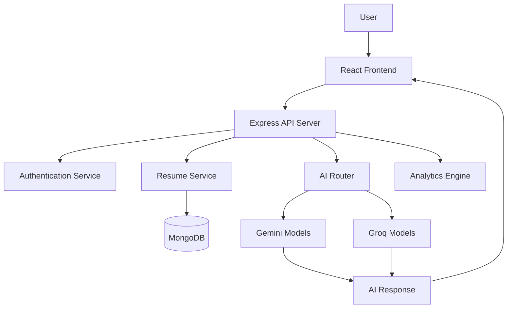
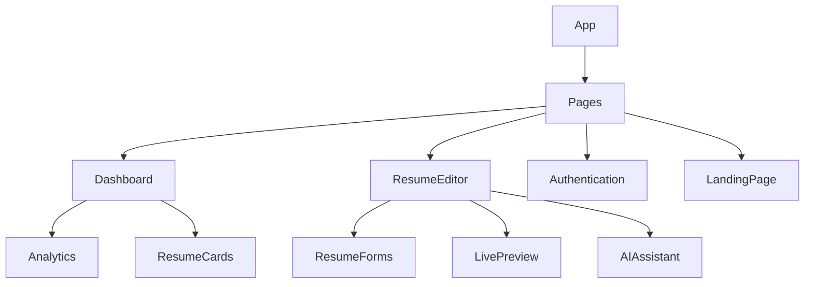
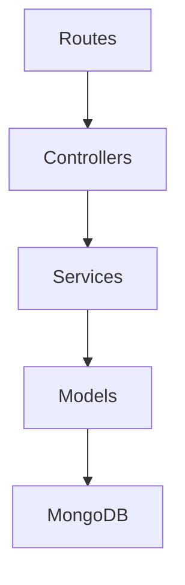
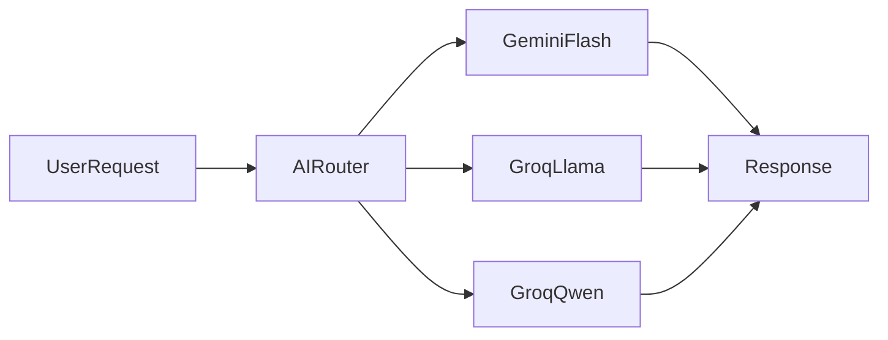
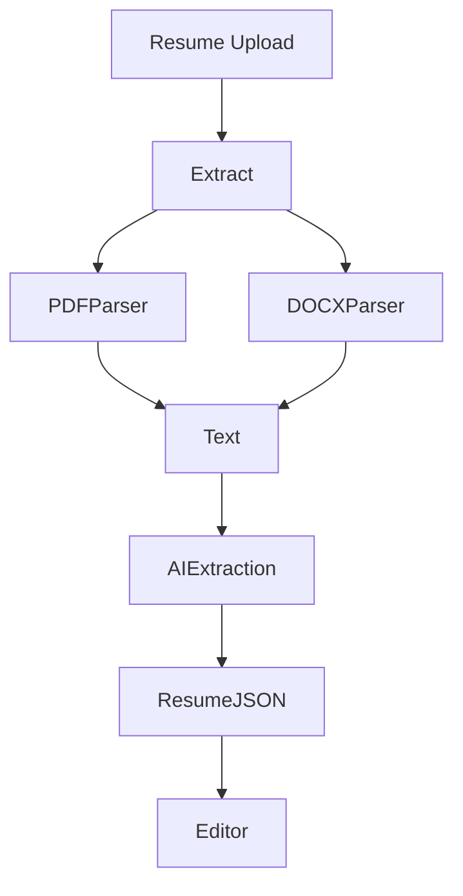
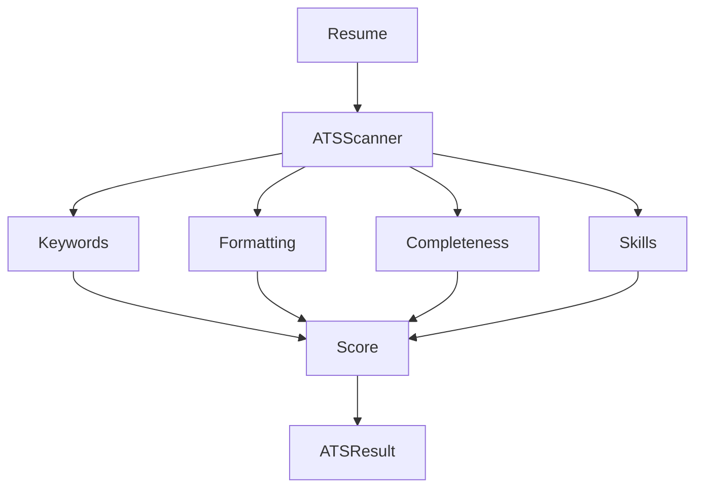
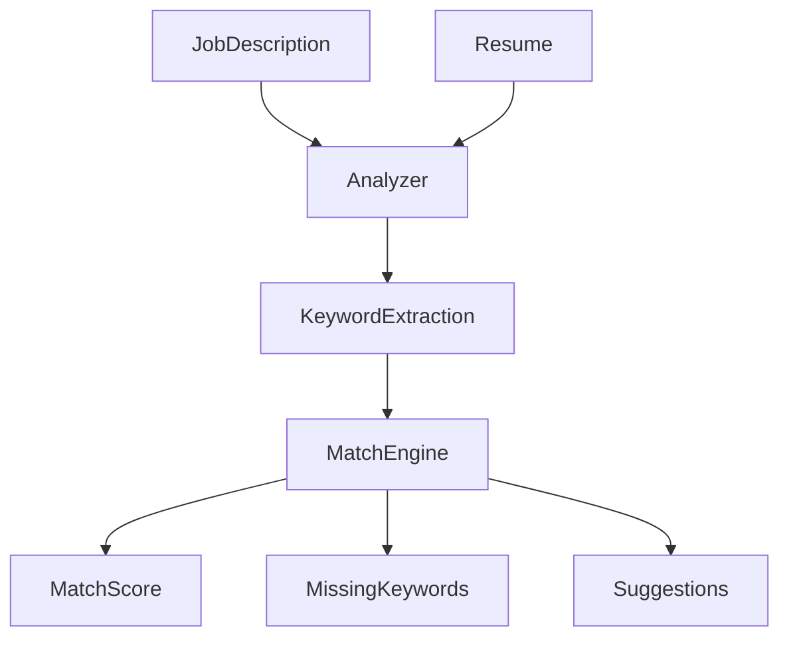
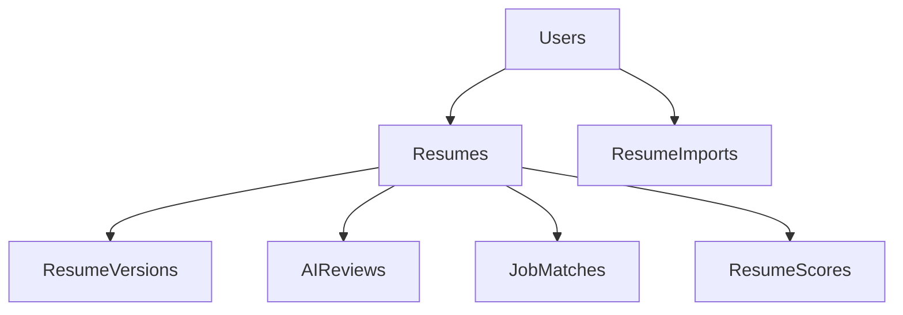
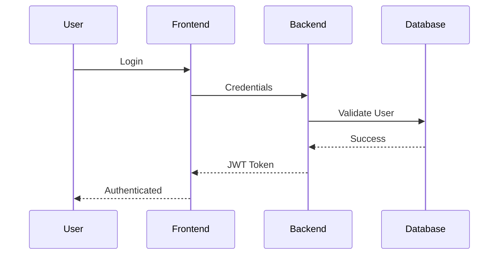
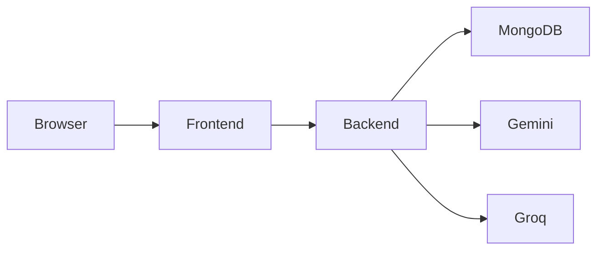

# 🏗️ ResumeRocket Architecture

This document describes the high-level architecture, component interactions, AI routing strategy, and data flow of ResumeRocket.

---

# 📌 Architecture Overview

ResumeRocket follows a modern full-stack architecture consisting of:

* React Frontend
* Express Backend API
* MongoDB Database
* AI Routing Layer
* Gemini & Groq LLM Providers
* Resume Processing Engine

The architecture is designed to provide:

* Scalability
* Maintainability
* Fast AI Responses
* ATS Optimization
* Resume Parsing
* Production Deployment Support

---

# 🌐 High-Level Architecture



---

# 🎨 Frontend Architecture

The frontend is built using React and follows a component-driven architecture.



---

## Frontend Responsibilities

### Authentication

Handles:

* Login
* Registration
* JWT Storage
* Protected Routes

### Resume Editor

Provides:

* Dynamic Resume Forms
* Real-Time Editing
* Template Switching
* Theme Customization

### Live Preview

Generates:

* Instant Resume Preview
* Print Layout View
* PDF Export View

### Dashboard

Displays:

* User Resumes
* Analytics
* ATS Scores
* Resume Progress

---

# ⚙️ Backend Architecture

The backend follows a layered architecture.



---

## Backend Layers

### Routes

Responsible for:

* API Endpoints
* Middleware Registration
* Request Validation

### Controllers

Responsible for:

* Business Logic Coordination
* Response Formatting
* Error Handling

### Services

Responsible for:

* AI Routing
* Resume Processing
* ATS Analysis
* Resume Parsing

### Models

Responsible for:

* MongoDB Communication
* Data Persistence
* Schema Validation

---

# 🤖 AI Architecture

One of the core strengths of ResumeRocket is its provider-agnostic AI routing layer.

Instead of relying on a single AI provider, requests are routed intelligently.

---

## AI Request Flow



---

## Routing Strategy

### Content Generation

Used for:

* Resume Summary
* Experience Generation
* Project Descriptions

Priority:

```text
Gemini Flash
→ Groq Llama
→ Groq Qwen
```

---

### ATS Analysis

Used for:

* Resume Review
* Keyword Analysis
* ATS Scoring

Priority:

```text
Groq Llama
→ Groq Qwen
→ Gemini Flash
```

---

## Benefits

### High Availability

If one provider fails:

```text
Gemini
↓
Fallback
↓
Groq
```

No user interruption.

---

### Better Latency

Different tasks are routed to models best suited for them.

---

### Cost Optimization

Uses free-tier models efficiently.

---

# 📂 Resume Processing Architecture

ResumeRocket can import existing resumes.

---

## Import Pipeline



---

## Supported Formats

* PDF
* DOCX

---

## Extracted Sections

* Personal Information
* Summary
* Education
* Experience
* Projects
* Skills
* GitHub Links
* LinkedIn Links
* Portfolio Links

---

# 📊 ATS Analysis Architecture

ResumeRocket performs ATS analysis using rule-based and AI-assisted techniques.

---

## ATS Flow



---

## Analysis Categories

### ATS Score

Measures:

* Keyword Relevance
* Structure
* Readability

### Content Quality

Measures:

* Professional Language
* Clarity
* Impact

### Resume Completeness

Measures:

* Missing Sections
* Contact Information
* Projects
* Skills

---

# 🎯 Job Description Matching

ResumeRocket compares resumes against job descriptions.

---

## JD Match Pipeline



---

## Output

Users receive:

* Match Percentage
* Missing Keywords
* Skill Gaps
* Improvement Suggestions

---

# 💾 Data Storage Architecture



---

# 🔐 Security Architecture

ResumeRocket uses JWT authentication.

---

## Authentication Flow



---

## Security Features

### JWT Authentication

Used for:

* User Sessions
* Protected APIs

### Password Hashing

Passwords are hashed before storage.

### Environment Variables

Sensitive data stored in:

```text
.env
```

Examples:

* MongoDB URI
* JWT Secret
* Gemini API Key
* Groq API Key

---

# 🚀 Deployment Architecture



---

## Production Environment

Frontend:

* React
* Vite
* Render

Backend:

* Node.js
* Express
* Render

Database:

* MongoDB Atlas

AI Providers:

* Google Gemini
* Groq

---

# 📈 Scalability Considerations

Current architecture supports:

* Thousands of resume generations
* Multiple AI providers
* Resume versioning
* ATS analysis
* Resume parsing

Future scaling strategies include:

* Redis Caching
* Queue-Based AI Requests
* CDN Optimization
* Distributed Processing
* Multi-Region Deployments

---

# 🎯 Architectural Highlights

ResumeRocket demonstrates:

* Full-Stack Development
* Layered Backend Design
* AI Provider Abstraction
* Resume Parsing Pipelines
* ATS Optimization Systems
* Production Deployment
* Scalable Architecture Principles

The architecture is intentionally designed to resemble real-world SaaS platforms while remaining approachable for students and recruiters reviewing the project.
