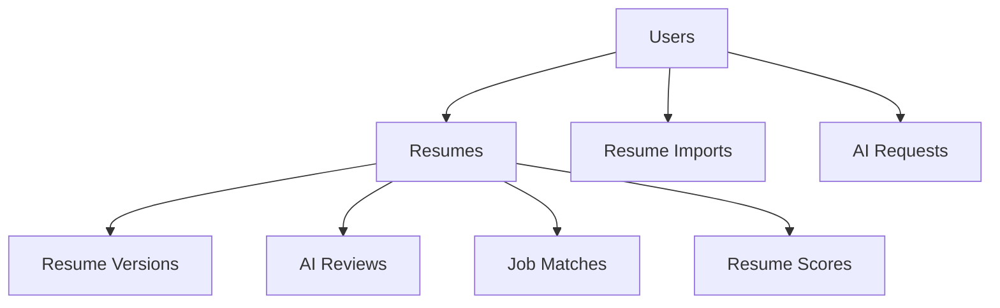
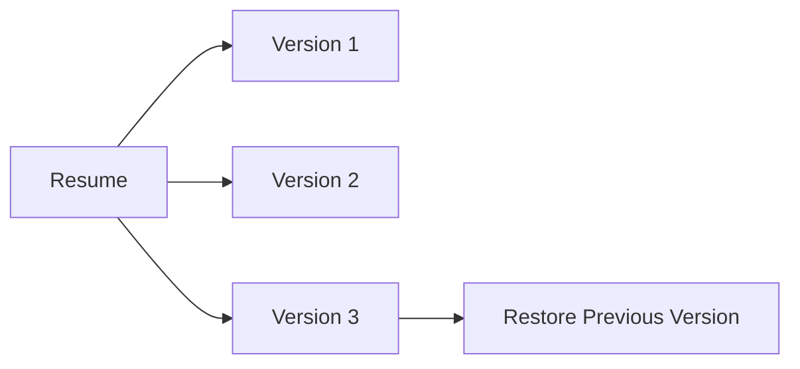
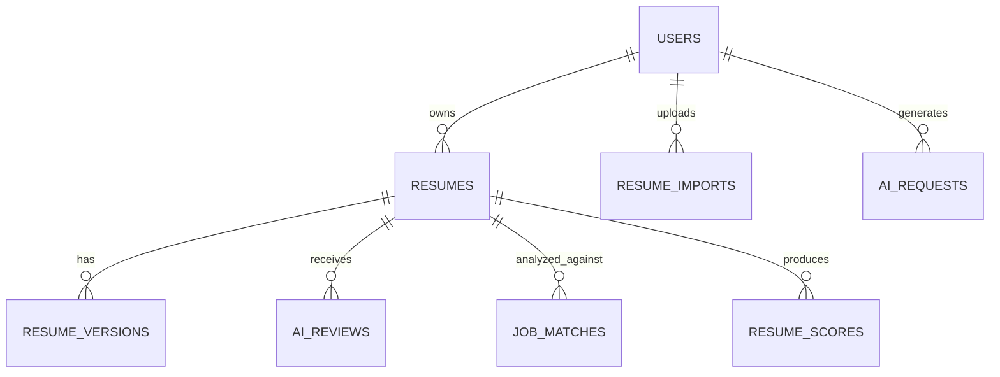

# 🗄️ ResumeRocket Database Design

This document explains the database architecture, collections, relationships, schema design decisions, and scalability considerations used in ResumeRocket.

---

# 📌 Database Overview

ResumeRocket uses **MongoDB Atlas** as its primary database.

MongoDB was chosen because:

* Flexible document structure
* Rapid development
* Nested resume sections
* Easy schema evolution
* Excellent support for JSON-like resume data

---

# 🏗️ Database Architecture



---

# 📊 Collections Overview

| Collection     | Purpose                        |
| -------------- | ------------------------------ |
| Users          | Authentication & user profiles |
| Resumes        | Main resume data               |
| ResumeVersions | Resume history tracking        |
| AIReviews      | ATS & AI review results        |
| JobMatches     | Job description matching       |
| ResumeScores   | Historical score tracking      |
| ResumeImports  | Imported resume logs           |
| AIRequests     | AI analytics & monitoring      |

---

# 👤 Users Collection

Stores registered users.

## Purpose

* Authentication
* Authorization
* Resume ownership

---

## Schema

```javascript
{
  _id: ObjectId,

  name: String,

  email: String,

  password: String,

  createdAt: Date,

  updatedAt: Date
}
```

---

## Relationships

```text
User
 ├── Multiple Resumes
 ├── Multiple Resume Imports
 └── Multiple AI Requests
```

---

# 📄 Resumes Collection

Core collection of the application.

Stores complete resume data.

---

## Schema

```javascript
{
  _id: ObjectId,

  userId: ObjectId,

  title: String,

  template: String,

  theme: String,

  personalInfo: {
    fullName: String,
    email: String,
    phone: String,
    github: String,
    linkedin: String,
    portfolio: String
  },

  summary: String,

  education: [],

  experience: [],

  projects: [],

  skills: [],

  languages: [],

  certifications: [],

  createdAt: Date,

  updatedAt: Date
}
```

---

## Relationships

```text
Resume
 ├── Resume Versions
 ├── AI Reviews
 ├── Job Matches
 └── Resume Scores
```

---

# 🔄 Resume Versions Collection

Stores snapshots of resumes.

Used for:

* Undo capability
* History tracking
* Resume restoration

---

## Schema

```javascript
{
  _id: ObjectId,

  resumeId: ObjectId,

  versionNumber: Number,

  label: String,

  resumeData: Object,

  themeConfig: Object,

  createdAt: Date
}
```

---

## Version Flow



---

# 🤖 AI Reviews Collection

Stores ATS and AI-generated review results.

---

## Schema

```javascript
{
  _id: ObjectId,

  resumeId: ObjectId,

  overallScore: Number,

  categories: {
    ats: Number,
    content: Number,
    formatting: Number,
    projects: Number,
    keywords: Number,
    completeness: Number
  },

  suggestions: [
    {
      id: String,
      section: String,
      text: String,
      status: String
    }
  ],

  createdAt: Date
}
```

---

## Purpose

Provides:

* ATS feedback
* Resume quality analysis
* Optimization suggestions

---

# 🎯 Job Matches Collection

Stores Job Description analysis results.

---

## Schema

```javascript
{
  _id: ObjectId,

  resumeId: ObjectId,

  jobDescription: String,

  matchScore: Number,

  keywordMatch: Number,

  skillsMatch: Number,

  experienceMatch: Number,

  matchedKeywords: [String],

  missingKeywords: [String],

  suggestions: [Object],

  createdAt: Date
}
```

---

## Purpose

Enables:

* Resume tailoring
* ATS optimization
* Job targeting

---

# 📈 Resume Scores Collection

Stores historical ATS scores.

---

## Schema

```javascript
{
  _id: ObjectId,

  resumeId: ObjectId,

  score: Number,

  missingItems: [String],

  suggestions: [String],

  createdAt: Date
}
```

---

## Purpose

Tracks:

* Resume improvements
* ATS progression
* User growth over time

---

# 📂 Resume Imports Collection

Stores imported resume metadata.

---

## Schema

```javascript
{
  _id: ObjectId,

  userId: ObjectId,

  fileName: String,

  fileType: String,

  confidenceScores: Object,

  importedAt: Date
}
```

---

## Purpose

Tracks:

* Imported files
* Parsing quality
* Resume conversion success

---

# 📡 AI Requests Collection

Stores AI request analytics.

---

## Schema

```javascript
{
  _id: ObjectId,

  requestType: String,

  provider: String,

  model: String,

  latency: Number,

  success: Boolean,

  error: String,

  timestamp: Date
}
```

---

## Purpose

Tracks:

* AI performance
* Model usage
* Error monitoring
* Latency analytics

---

# 🔗 Collection Relationships



---

# 📈 Query Optimization Strategy

Indexes should be created on:

```javascript
userId
resumeId
email
createdAt
```

---

## Recommended Indexes

### Users

```javascript
email: 1
```

Used for:

* Login
* Registration checks

---

### Resumes

```javascript
userId: 1
```

Used for:

* Dashboard loading
* Resume listing

---

### Resume Versions

```javascript
resumeId: 1
```

Used for:

* History retrieval

---

### Job Matches

```javascript
resumeId: 1
```

Used for:

* JD match history

---

### AI Requests

```javascript
provider: 1
timestamp: 1
```

Used for:

* Analytics
* Monitoring

---

# 🚀 Scalability Considerations

Current database design supports:

* Thousands of users
* Thousands of resumes
* Frequent AI requests
* Resume versioning

---

## Future Scaling Strategies

### Caching

Introduce Redis for:

* ATS results
* AI responses
* JD match results

---

### Archival Storage

Move older versions to:

* Cold Storage
* Separate collections

---

### Analytics Warehouse

Store historical metrics in:

* ClickHouse
* BigQuery
* MongoDB Data Lake

---

# 🔐 Security Considerations

Sensitive data never stored in plain text.

---

## Password Security

Passwords are hashed using:

```text
bcryptjs
```

---

## Environment Variables

Secrets stored in:

```text
.env
```

Examples:

```text
JWT_SECRET
MONGO_URI
GEMINI_API_KEY
GROQ_API_KEY
```

---

# 🎯 Design Highlights

The ResumeRocket database architecture was designed to support:

* AI Resume Generation
* ATS Analysis
* Resume Parsing
* Job Matching
* Resume Versioning
* Analytics Tracking

while maintaining flexibility, scalability, and simplicity.

This schema design reflects production-oriented SaaS architecture principles and supports future growth with minimal structural changes.
