# 🏛️ ResumeRocket System Design

This document explains the end-to-end system design of ResumeRocket, including architecture decisions, AI routing, ATS analysis, resume parsing, scalability considerations, and future improvements.

---

# 📌 System Overview

ResumeRocket is an AI-powered Resume Optimization Platform that helps users:

* Create Professional Resumes
* Generate AI-Powered Content
* Analyze ATS Compatibility
* Match Resumes Against Job Descriptions
* Import Existing Resumes
* Track Resume Improvements
* Export Production-Ready PDFs

The system combines traditional SaaS architecture with modern LLM-powered workflows.

---

# 🎯 Design Goals

The system was designed with the following objectives:

### Functional Goals

* Resume Creation
* Resume Editing
* Resume Import
* ATS Analysis
* JD Matching
* AI Content Generation
* Resume Versioning

### Non-Functional Goals

* Low Latency
* High Availability
* Scalability
* Fault Tolerance
* Cost Efficiency
* Easy Maintenance

---

# 🏗️ High-Level System Architecture

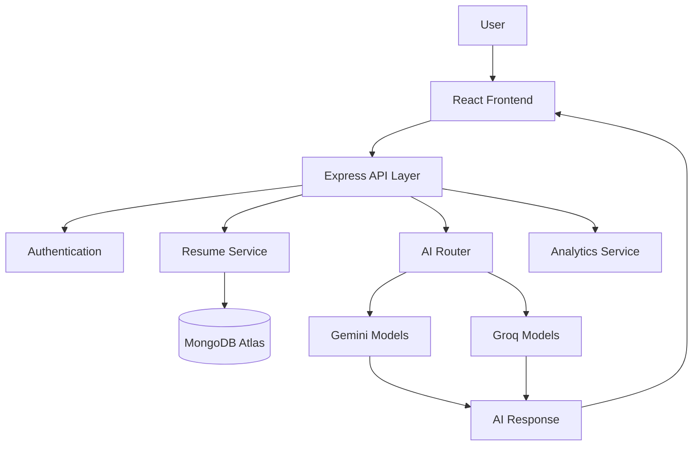

---

# 🎨 Frontend Design

The frontend follows a component-based architecture.

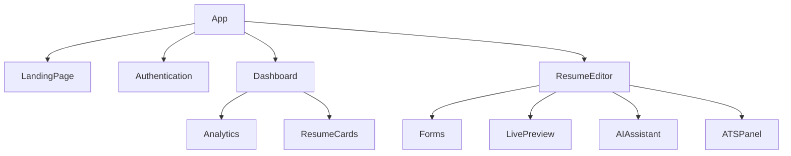

---

## Responsibilities

### Landing Page

* Marketing
* Feature Showcase
* User Conversion

### Dashboard

* Resume Management
* Analytics
* ATS Tracking

### Resume Editor

* Dynamic Forms
* AI Assistance
* Live Preview
* Theme Customization

---

# ⚙️ Backend Design

The backend follows a layered architecture.

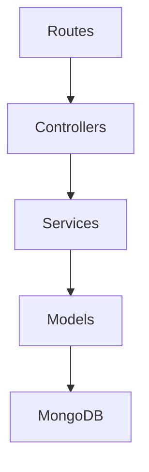

---

## Why Layered Architecture?

Benefits:

* Separation of Concerns
* Easier Testing
* Better Maintainability
* Reusable Services
* Cleaner Scaling

---

# 🤖 AI System Design

One of the most important components of ResumeRocket is the AI routing layer.

Instead of depending on a single provider, the platform dynamically routes requests.

---

## AI Request Flow

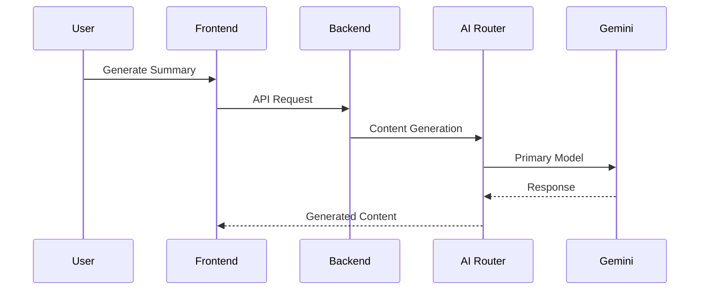

---

# AI Router Architecture

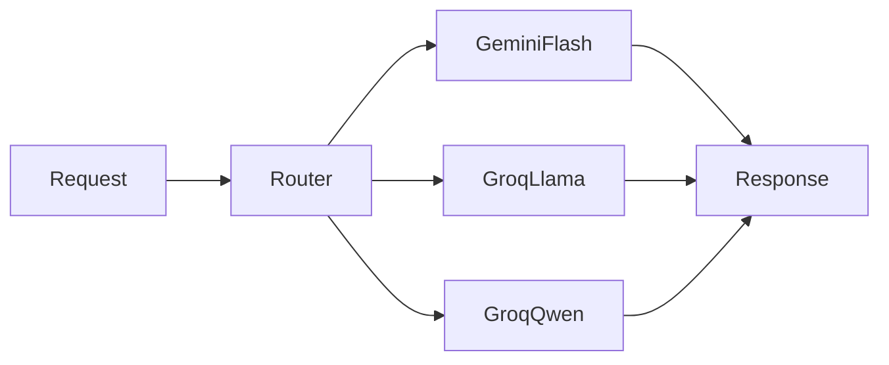

---

## Why Multi-Provider AI?

### Problem

Single provider architecture suffers from:

* Downtime
* Rate Limits
* Slow Responses
* Vendor Dependency

---

### Solution

Use multiple providers.

Benefits:

* Automatic Failover
* Improved Reliability
* Better Availability
* Reduced Latency

---

# AI Routing Strategy

## Resume Generation

Tasks:

* Summary Generation
* Experience Writing
* Project Writing

Priority:

```text
Gemini Flash
↓
Groq Llama
↓
Groq Qwen
```

---

## ATS Analysis

Tasks:

* Keyword Analysis
* Resume Review
* ATS Suggestions

Priority:

```text
Groq Llama
↓
Groq Qwen
↓
Gemini Flash
```

---

# Resume Import System

ResumeRocket allows users to upload existing resumes.

Supported formats:

* PDF
* DOCX

---

## Import Pipeline

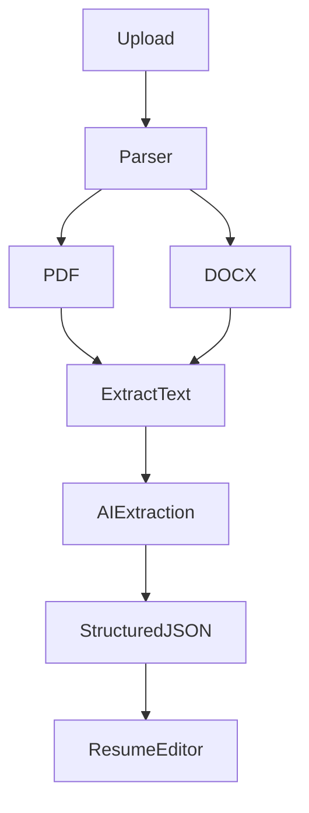

---

## Why AI Parsing?

Traditional parsing fails because resumes vary significantly.

AI parsing allows:

* Flexible Layout Recognition
* Better Data Extraction
* Section Understanding
* Improved Accuracy

---

# ATS Analysis Design

ATS analysis combines:

* Rule-Based Scoring
* AI-Based Review

---

## ATS Flow

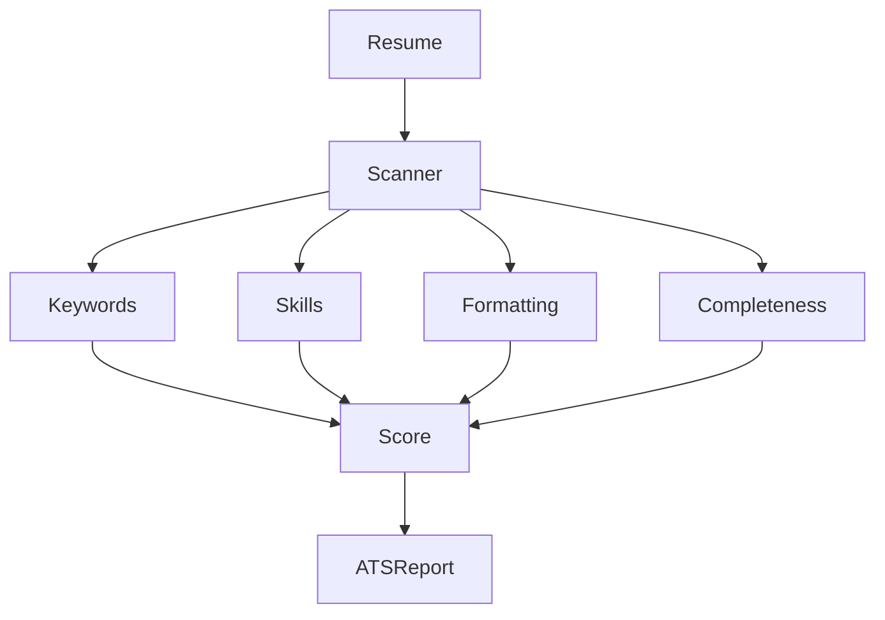

---

## ATS Categories

### Keywords

Measures:

* Industry Keywords
* Technical Keywords
* Missing Terms

---

### Skills

Measures:

* Relevant Skills
* Job Alignment

---

### Formatting

Measures:

* Structure
* Readability
* ATS Compatibility

---

### Completeness

Measures:

* Missing Sections
* Contact Information
* Education
* Projects

---

# Job Description Matching System

Users can paste any Job Description.

---

## Matching Pipeline

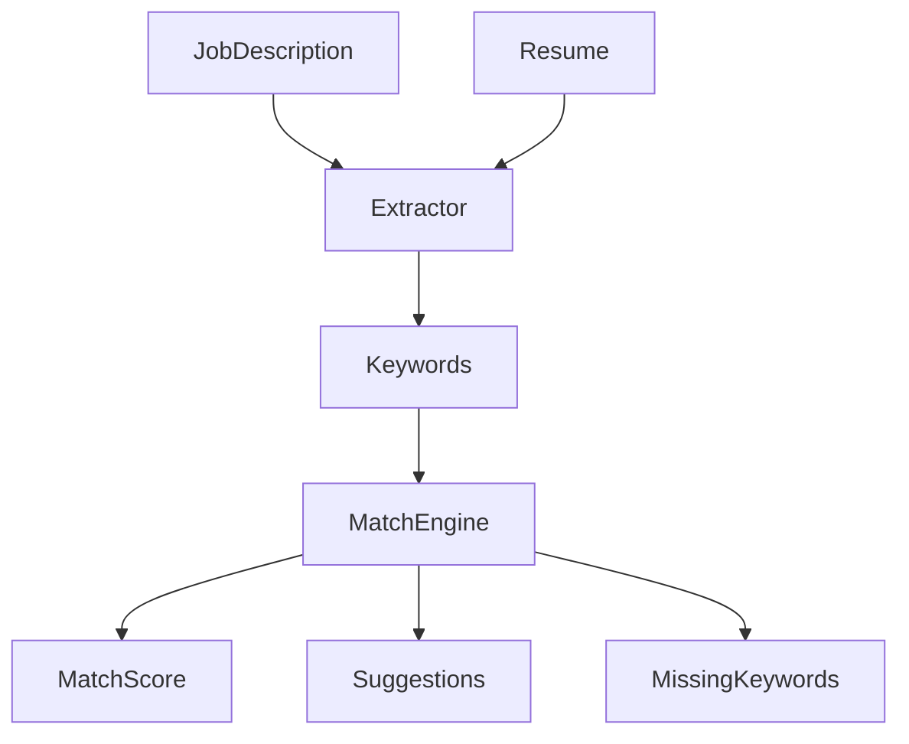

---

# Resume Versioning System

Versioning enables users to track resume evolution.

---

## Workflow

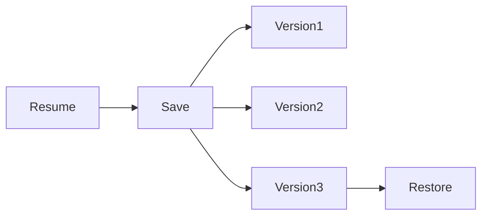

---

## Benefits

* Undo Capability
* History Tracking
* Experimentation
* Recovery

---

# Database Design

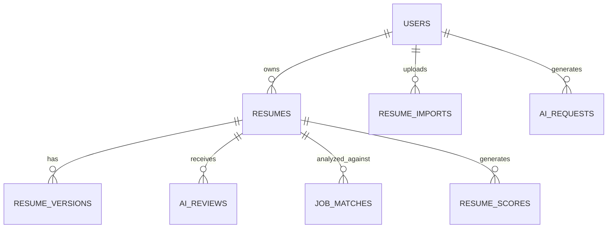

---

# Security Design

## Authentication

Uses JWT.

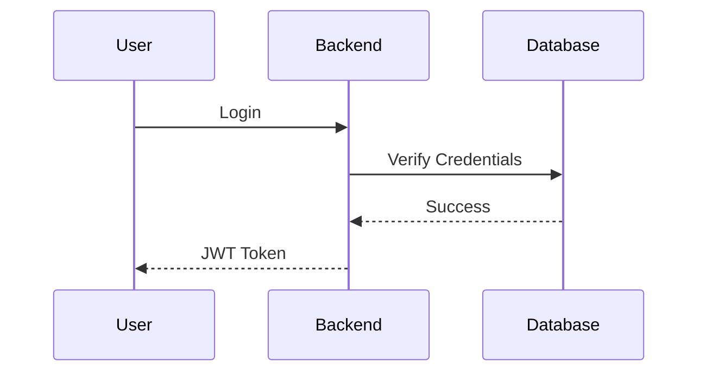

---

## Security Measures

### Password Hashing

```text
bcryptjs
```

Used before storage.

---

### Environment Variables

Secrets stored in:

```text
.env
```

Examples:

```text
JWT_SECRET
MONGO_URI
GEMINI_API_KEY
GROQ_API_KEY
```

---

### Protected Routes

Middleware verifies:

* JWT Token
* User Identity
* Resource Ownership

---

# Performance Optimization

## Current Optimizations

### AI Request Routing

Reduces latency.

### Resume Caching

Prevents duplicate AI calls.

### Optimized Queries

Indexes on:

```text
userId
resumeId
email
createdAt
```

---

# Scalability Design

Current system supports:

* Thousands of Users
* Thousands of Resumes
* Concurrent AI Requests

---

## Future Scaling Plan

### Level 1

Introduce Redis.

Used for:

* ATS Results
* JD Matches
* AI Responses

---

### Level 2

Introduce Queue Processing.

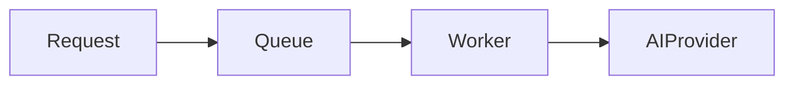

Benefits:

* Rate Limit Protection
* Better Throughput

---

### Level 3

Microservice Architecture

Split:

* Authentication Service
* Resume Service
* AI Service
* Analytics Service

---

# Failure Handling

## AI Provider Failure

```text
Gemini Down
↓
Fallback
↓
Groq
```

User still receives a response.

---

## Database Failure

Fallback:

* Retry Logic
* Error Logging
* Graceful Degradation

---

## API Failure

Implemented:

* Centralized Error Handling
* Validation Layer
* Request Logging

---

# Trade-Offs

## Why MongoDB?

Pros:

* Flexible Schema
* Fast Development
* Nested Resume Data

Cons:

* Less strict than SQL

Chosen because resume structures vary significantly.

---

## Why Multiple AI Providers?

Pros:

* Reliability
* Failover
* Better Performance

Cons:

* More Complex Routing

Benefits outweigh complexity.

---

# Future Enhancements

Planned features:

* AI Mock Interviews
* Cover Letter Generator
* Portfolio Generator
* LinkedIn Optimizer
* Recruiter Dashboard
* Resume Benchmarking
* Real-Time Collaboration

---

# Key Engineering Takeaways

ResumeRocket demonstrates:

* Full Stack Engineering
* Production System Design
* AI Integration
* Multi-Provider Architecture
* ATS Optimization Logic
* Resume Parsing Pipelines
* Authentication & Security
* Scalable SaaS Design

The architecture is intentionally designed to mirror real-world AI SaaS platforms while remaining accessible and maintainable for individual developers and student teams.
